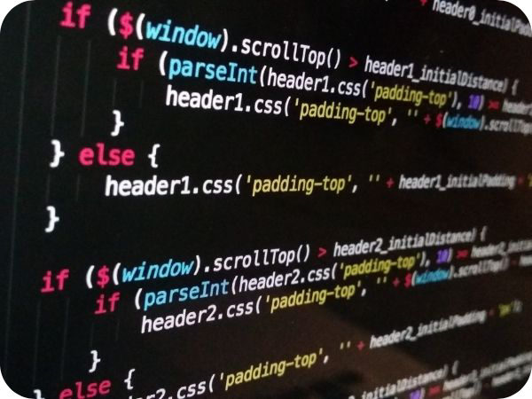

# ¿Qué es la programación de computadores? :computer:

Los computadores hoy en día dominan nuestro mundo y nos permiten llevar a cabo muchas tareas. De hecho, se puede considerar como una herramienta que existe para facilitarnos la vida en nuestras labores diarias. ¿Quieres saber qué es la **programación de computadores** y como se hace? Entonces, sigue aquí y averígualo.

<h6>Extraído de [Euroinnova.co](https://www.euroinnova.co/blog/que-es-programacion-de-computadoras).
